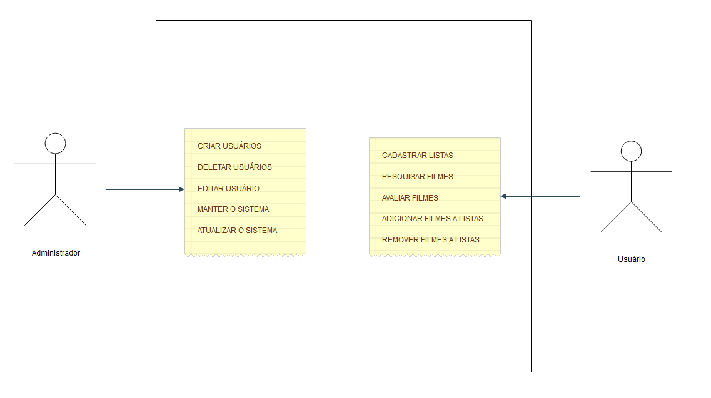
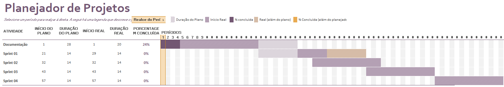

# Especificações do Projeto

Pré-requisitos: <a href="1-Documentação de Contexto.md"> Documentação de Contexto</a>

O projeto CineFácil aborda uma necessidade concreta no mercado de entretenimento. Ele oferece uma solução abrangente e única para simplificar a experiência de assistir filmes e séries, tornando mais fácil para os usuários encontrar o que desejam e personalizar sua organização. Além disso, as recomendações inteligentes fornecidas pela aplicação ajudarão os usuários a descobrir novos conteúdos que se alinham com seus gostos, aprimorando assim sua experiência de entretenimento de maneira significativa.

## Personas

Persona 1: Maria
Descrição:

    Idade: 30 anos
    Ocupação: Professora
    Estado Civil: Casada
    Objetivo: Encontrar facilmente filmes e séries para assistir com sua família, economizando tempo na busca e organização do entretenimento.

Contexto:
Maria é uma professora dedicada com uma vida agitada. Ela adora assistir a filmes e séries com sua família nas horas vagas, mas muitas vezes se sente sobrecarregada pela dificuldade de encontrar títulos interessantes e descobrir em qual plataforma estão disponíveis. Maria busca uma solução que simplifique a busca, permita criar listas personalizadas para diferentes membros da família e ofereça recomendações inteligentes com base nos gostos de sua família.

Persona 2: João

Descrição:

    Idade: 35 anos
    Ocupação: Gerente de Marketing
    Estado Civil: Solteiro
    Objetivo: Descobrir filmes e séries de alta qualidade para desfrutar em seu tempo livre, buscando uma experiência de entretenimento mais enriquecedora.

Contexto:
João é um profissional de marketing bem-sucedido que leva uma vida agitada na cidade. Ele valoriza seu tempo de lazer e gosta de relaxar assistindo a filmes e séries. No entanto, ele está em busca de conteúdo de alta qualidade que o envolva intelectualmente e emocionalmente. João procura uma solução que lhe forneça recomendações de conteúdo relevante e informativo, ajudando-o a maximizar seu tempo de entretenimento.

Persona 3: Ana

Descrição:

    Idade: 40 anos
    Ocupação: Médica
    Estado Civil: Casada e mãe de dois filhos
    Objetivo: Encontrar filmes e séries adequados para assistir em família, proporcionando entretenimento seguro e educativo para seus filhos.

Contexto:
Ana é uma médica ocupada e mãe de dois filhos pequenos. Ela valoriza o tempo que passa com sua família e, nos fins de semana, gosta de assistir a filmes e séries com seus filhos. No entanto, ela enfrenta o desafio de encontrar conteúdo apropriado para crianças que seja educativo e divertido. Ana está em busca de uma solução que a ajude a descobrir filmes e séries que sejam seguros para seus filhos e, ao mesmo tempo, ofereçam entretenimento educativo para toda a família.

## Histórias de Usuários

Com base na análise das personas forma identificadas as seguintes histórias de usuários:

|EU COMO... `PERSONA`| QUERO/PRECISO ... `FUNCIONALIDADE` |PARA ... `MOTIVO/VALOR`                 |
|--------------------|------------------------------------|----------------------------------------|
|João  | Receber recomendações de filmes e séries de alta qualidade com base em meus interesses e preferências           | Desfrutar de uma experiência de entretenimento mais enriquecedora.               |
|João  | Poder filtrar as recomendações por gênero, classificação etária e críticas da comunidade           | Encontrar conteúdo que se adapte ao meu estado de espírito e às minhas expectativas de qualidade.               |
|João  | Acompanhar os filmes e séries que já assisti           | Evitar assistir ao mesmo conteúdo novamente.               |
|Ana       | Encontrar facilmente filmes e séries adequados para assistir em família, garantindo que o conteúdo seja seguro e educativo para meus filhos.                 | Assegurar entretenimento seguro e educativo para minha família. |
|Ana       | Criar listas de reprodução personalizadas para diferentes faixas etárias de meus filhos.                 | Organizar o entretenimento de acordo com suas idades e interesses. |
|Ana       | Receber informações detalhadas sobre o conteúdo, incluindo classificação etária, sinopse e avaliações parentais                 | Tomar decisões informadas sobre o que assistir com minha família. |
|Maria       | Simplificar a busca por filmes e séries para assistir com minha família, economizando tempo na pesquisa e organização do entretenimento.                 | Economizar tempo na pesquisa e organização do entretenimento. |
|Maria       | Criar listas de reprodução personalizadas para diferentes membros da minha família, como meus filhos e meu marido                 | Tornar a escolha de conteúdo mais conveniente e organizada. |
|Maria       | Receber recomendações inteligentes com base nos gostos e histórico de visualização da minha família                 | Descobrir novos conteúdos que se adaptem aos nossos interesses compartilhados. |

## Requisitos

As tabelas que se seguem apresentam os requisitos funcionais e não funcionais que detalham o escopo do projeto. Para determinar a prioridade de requisitos, aplicar uma técnica de priorização de requisitos e detalhar como a técnica foi aplicada.

### Requisitos Funcionais

|ID    | Descrição do Requisito  | Prioridade |
|------|-----------------------------------------|----|
|RF-001| A aplicação deve fornecer recomendações de filmes e séries de alta qualidade com base nos interesses e preferências do usuário | ALTA | 
|RF-002| A aplicação deve permitir que o usuário filtre as recomendações por gênero, classificação etária e críticas da comunidade   | ALTA |
|RF-003| A aplicação deve fornecer uma função de acompanhamento para que o usuário possa marcar os filmes e séries que já assistiu   | MÉDIA |
|RF-004| A aplicação deve permitir que o usuário crie listas de reprodução personalizadas, associando-as a perfis de membros da família   | MÉDIA |
|RF-005| A aplicação deve fornecer informações detalhadas sobre o conteúdo, incluindo classificação etária, sinopse e avaliações parentais   | ALTA |
|RF-006| A aplicação deve oferecer recomendações inteligentes com base nos gostos e histórico de visualização do usuário   | ALTA |

### Requisitos não Funcionais

|ID     | Descrição do Requisito  |Prioridade |
|-------|-------------------------|----|
|RNF-001|A aplicação deve ter uma interface de usuário intuitiva e amigável, adequada para pessoas com diferentes níveis de habilidade técnica | ALTA | 
|RNF-002| A aplicação deve ser responsiva e compatível com dispositivos móveis, garantindo uma experiência consistente em smartphones e tablets |  ALTA | 
|RNF-002| A aplicação deve processar as requisições do usuário, como pesquisa e filtragem, em no máximo 3 segundos para garantir a eficiência da experiência do usuário |  MÉDIA | 
|RNF-002| A aplicação deve fornecer informações atualizadas sobre os filmes e séries disponíveis, garantindo a precisão dos dados |  ALTA | 
|RNF-002| A aplicação deve ser segura, protegendo as informações do usuário e mantendo a privacidade dos dados pessoais |  ALTA | 

## Restrições

O projeto está restrito pelos itens apresentados na tabela a seguir.

|ID| Restrição                                             |
|--|-------------------------------------------------------|
|01| O projeto deverá ser entregue até o final do semestre |
|02| A aplicação será desenvolvida para dispositivos móveis, priorizando a acessibilidade e usabilidade em smartphones e tablets        |
|03| O projeto deve cumprir todas as regulamentações de proteção de dados e privacidade, garantindo que as informações dos usuários sejam mantidas em sigilo absoluto.        |
|04| A aplicação será desenvolvida para funcionar em sistemas operacionais iOS e Android, abrangendo uma ampla gama de dispositivos móveis.        |
|05| A equipe de desenvolvimento deve seguir as melhores práticas de segurança cibernética e realizar testes de segurança rigorosos antes do lançamento da aplicação.        |

## Diagrama de Casos de Uso

O nosso diagrama de casos de uso consiste principalmente em dois atores, o usuário e o administrador, onde o usuário irá interagir com a parte de consumo do conteúdo oferecido pela nossa aplicação e o administrador que irá cuidar do sistema como um todo resolvendo eventuais conflitos de regras de negócios e requisitos do sistema, assim como eventuais ações paleativas para erros de usuários.

# Gerenciamento de Projeto

1. Definição do Escopo do Projeto CineFácil:

    O escopo do projeto CineFácil é criar uma aplicação móvel que permita aos usuários pesquisar filmes e séries, criar listas de reprodução personalizadas, receber recomendações com base em suas preferências, rastrear o histórico de visualização e acessar informações detalhadas sobre conteúdo. O projeto visa oferecer uma experiência de entretenimento mais conveniente e personalizada para os usuários.

2. Escopo do Produto vs. Escopo do Projeto:

    O escopo do produto inclui todas as funcionalidades da aplicação CineFácil, como pesquisa de filmes, recomendações personalizadas, criação de listas de reprodução, integração com múltiplas plataformas de streaming, detalhes do conteúdo, histórico de visualização e configuração de perfis de família.
    O escopo do projeto abrange as atividades necessárias para desenvolver, testar, implantar e manter a aplicação, incluindo o desenvolvimento de software, gerenciamento de projeto, testes de qualidade e criação de documentação.

3. Documentação de Requisitos:

    Os requisitos da aplicação CineFácil foram documentados de forma abrangente, incluindo descrições detalhadas das funcionalidades, critérios de aceitação, requisitos de desempenho, interfaces do usuário e requisitos de segurança de dados.

4. Especificação de Limitações e Restrições:

    Algumas limitações e restrições incluem:
        Orçamento limitado para desenvolvimento.
        Requisitos de privacidade de dados em conformidade com regulamentações.
        Disponibilidade em plataformas iOS e Android.

5. Validando o Escopo com as Partes Interessadas:

    O escopo do projeto e do produto foi validado com as partes interessadas, incluindo representantes da equipe de desenvolvimento, usuários finais e administradores.

6. Controle de Mudanças no Escopo:

    Durante o projeto CineFácil, qualquer mudança proposta no escopo passará por uma avaliação rigorosa para determinar seu impacto no cronograma, custos e qualidade. Mudanças não aprovadas não serão implementadas sem consideração cuidadosa.

7. Gestão do Escopo ao Longo do Projeto:

    A equipe de gerenciamento monitorará continuamente o progresso em relação ao escopo definido, identificando quaisquer desvios ou variações e tomando medidas corretivas, quando necessário.

8. Entrega Conforme o Escopo:

    No final do projeto, será realizado um processo de revisão para garantir que todas as funcionalidades e requisitos definidos no escopo tenham sido entregues conforme planejado.

A aplicação eficaz dos conceitos de escopo no projeto CineFácil ajudará a garantir que o projeto permaneça dentro dos limites de tempo, orçamento e recursos definidos, ao mesmo tempo em que atende às expectativas dos usuários e fornece uma experiência de entretenimento de alta qualidade. Também ajuda a evitar expansões não planejadas que possam causar problemas de gerenciamento.

## Gerenciamento de Equipe

O gerenciamento adequado de tarefas contribuirá para que o projeto alcance altos níveis de produtividade. Por isso, é fundamental que ocorra a gestão de tarefas e de pessoas, de modo que os times envolvidos no projeto possam ser facilmente gerenciados. 

## Gestão de Orçamento

Será utilizado pelo projeto os seguintes recursos para orçamento:

