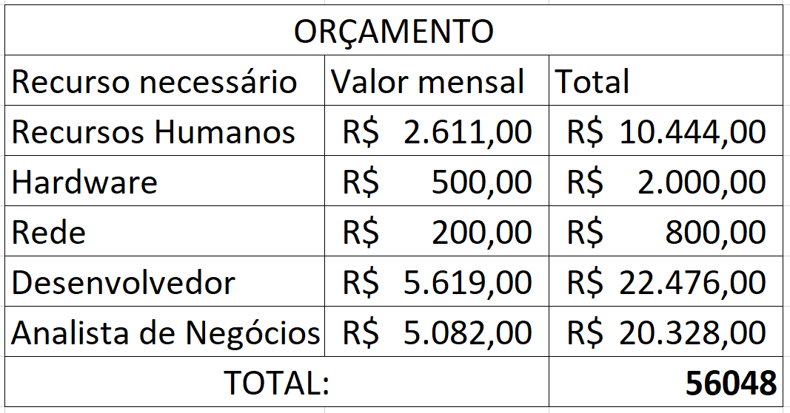

# Especificações do Projeto

Pré-requisitos: <a href="1-Documentação de Contexto.md"> Documentação de Contexto</a>

O projeto CineFácil aborda uma necessidade concreta no mercado de entretenimento. Ele oferece uma solução abrangente e única para simplificar a experiência de assistir filmes e séries, tornando mais fácil para os usuários encontrar o que desejam e personalizar sua organização. Além disso, as recomendações inteligentes fornecidas pela aplicação ajudarão os usuários a descobrir novos conteúdos que se alinham com seus gostos, aprimorando assim sua experiência de entretenimento de maneira significativa.

## Personas

Persona 1: Maria
Descrição:

    Idade: 30 anos
    Ocupação: Professora
    Estado Civil: Casada
    Objetivo: Encontrar facilmente filmes e séries para assistir com sua família, economizando tempo na busca e organização do entretenimento.

Contexto:
Maria é uma professora dedicada com uma vida agitada. Ela adora assistir a filmes e séries com sua família nas horas vagas, mas muitas vezes se sente sobrecarregada pela dificuldade de encontrar títulos interessantes e descobrir em qual plataforma estão disponíveis. Maria busca uma solução que simplifique a busca, permita criar listas personalizadas para diferentes membros da família e ofereça recomendações inteligentes com base nos gostos de sua família.

Persona 2: João

Descrição:

    Idade: 35 anos
    Ocupação: Gerente de Marketing
    Estado Civil: Solteiro
    Objetivo: Descobrir filmes e séries de alta qualidade para desfrutar em seu tempo livre, buscando uma experiência de entretenimento mais enriquecedora.

Contexto:
João é um profissional de marketing bem-sucedido que leva uma vida agitada na cidade. Ele valoriza seu tempo de lazer e gosta de relaxar assistindo a filmes e séries. No entanto, ele está em busca de conteúdo de alta qualidade que o envolva intelectualmente e emocionalmente. João procura uma solução que lhe forneça recomendações de conteúdo relevante e informativo, ajudando-o a maximizar seu tempo de entretenimento.

Persona 3: Ana

Descrição:

    Idade: 40 anos
    Ocupação: Médica
    Estado Civil: Casada e mãe de dois filhos
    Objetivo: Encontrar filmes e séries adequados para assistir em família, proporcionando entretenimento seguro e educativo para seus filhos.

Contexto:
Ana é uma médica ocupada e mãe de dois filhos pequenos. Ela valoriza o tempo que passa com sua família e, nos fins de semana, gosta de assistir a filmes e séries com seus filhos. No entanto, ela enfrenta o desafio de encontrar conteúdo apropriado para crianças que seja educativo e divertido. Ana está em busca de uma solução que a ajude a descobrir filmes e séries que sejam seguros para seus filhos e, ao mesmo tempo, ofereçam entretenimento educativo para toda a família.

## Histórias de Usuários

Com base na análise das personas forma identificadas as seguintes histórias de usuários:

|EU COMO... `PERSONA`| QUERO/PRECISO ... `FUNCIONALIDADE` |PARA ... `MOTIVO/VALOR`                 |
|--------------------|------------------------------------|----------------------------------------|
|João  | Receber recomendações de filmes e séries de alta qualidade com base em meus interesses e preferências           | Desfrutar de uma experiência de entretenimento mais enriquecedora.               |
|João  | Poder filtrar as recomendações por gênero, classificação etária e críticas da comunidade           | Encontrar conteúdo que se adapte ao meu estado de espírito e às minhas expectativas de qualidade.               |
|João  | Acompanhar os filmes e séries que já assisti           | Evitar assistir ao mesmo conteúdo novamente.               |
|Ana       | Encontrar facilmente filmes e séries adequados para assistir em família, garantindo que o conteúdo seja seguro e educativo para meus filhos.                 | Assegurar entretenimento seguro e educativo para minha família. |
|Ana       | Criar listas de reprodução personalizadas para diferentes faixas etárias de meus filhos.                 | Organizar o entretenimento de acordo com suas idades e interesses. |
|Ana       | Receber informações detalhadas sobre o conteúdo, incluindo classificação etária, sinopse e avaliações parentais                 | Tomar decisões informadas sobre o que assistir com minha família. |
|Maria       | Simplificar a busca por filmes e séries para assistir com minha família, economizando tempo na pesquisa e organização do entretenimento.                 | Economizar tempo na pesquisa e organização do entretenimento. |
|Maria       | Criar listas de reprodução personalizadas para diferentes membros da minha família, como meus filhos e meu marido                 | Tornar a escolha de conteúdo mais conveniente e organizada. |
|Maria       | Receber recomendações inteligentes com base nos gostos e histórico de visualização da minha família                 | Descobrir novos conteúdos que se adaptem aos nossos interesses compartilhados. |

## Requisitos

As tabelas que se seguem apresentam os requisitos funcionais e não funcionais que detalham o escopo do projeto. Para determinar a prioridade de requisitos, aplicar uma técnica de priorização de requisitos e detalhar como a técnica foi aplicada.

### Requisitos Funcionais

|ID    | Descrição do Requisito  | Prioridade |
|------|-----------------------------------------|----|
|RF-001| A aplicação deve fornecer recomendações de filmes e séries de alta qualidade com base nos interesses e preferências do usuário | ALTA | 
|RF-002| A aplicação deve permitir que o usuário filtre as recomendações por gênero, classificação etária e críticas da comunidade   | ALTA |
|RF-003| A aplicação deve fornecer uma função de acompanhamento para que o usuário possa marcar os filmes e séries que já assistiu   | MÉDIA |
|RF-004| A aplicação deve permitir que o usuário crie listas de reprodução personalizadas, associando-as a perfis de membros da família   | MÉDIA |
|RF-005| A aplicação deve fornecer informações detalhadas sobre o conteúdo, incluindo classificação etária, sinopse e avaliações parentais   | ALTA |
|RF-006| A aplicação deve oferecer recomendações inteligentes com base nos gostos e histórico de visualização do usuário   | ALTA |

### Requisitos não Funcionais

|ID     | Descrição do Requisito  |Prioridade |
|-------|-------------------------|----|
|RNF-001|A aplicação deve ter uma interface de usuário intuitiva e amigável, adequada para pessoas com diferentes níveis de habilidade técnica | ALTA | 
|RNF-002| A aplicação deve ser responsiva e compatível com dispositivos móveis, garantindo uma experiência consistente em smartphones e tablets |  ALTA | 
|RNF-002| A aplicação deve processar as requisições do usuário, como pesquisa e filtragem, em no máximo 3 segundos para garantir a eficiência da experiência do usuário |  MÉDIA | 
|RNF-002| A aplicação deve fornecer informações atualizadas sobre os filmes e séries disponíveis, garantindo a precisão dos dados |  ALTA | 
|RNF-002| A aplicação deve ser segura, protegendo as informações do usuário e mantendo a privacidade dos dados pessoais |  ALTA | 

## Restrições

O projeto está restrito pelos itens apresentados na tabela a seguir.

|ID| Restrição                                             |
|--|-------------------------------------------------------|
|01| O projeto deverá ser entregue até o final do semestre |
|02| A aplicação será desenvolvida para dispositivos móveis, priorizando a acessibilidade e usabilidade em smartphones e tablets        |
|03| O projeto deve cumprir todas as regulamentações de proteção de dados e privacidade, garantindo que as informações dos usuários sejam mantidas em sigilo absoluto.        |
|04| A aplicação será desenvolvida para funcionar em sistemas operacionais iOS e Android, abrangendo uma ampla gama de dispositivos móveis.        |
|05| A equipe de desenvolvimento deve seguir as melhores práticas de segurança cibernética e realizar testes de segurança rigorosos antes do lançamento da aplicação.        |

## Diagrama de Casos de Uso

O nosso diagrama de casos de uso consiste principalmente em dois atores, o usuário e o administrador, onde o usuário irá interagir com a parte de consumo do conteúdo oferecido pela nossa aplicação e o administrador que irá cuidar do sistema como um todo resolvendo eventuais conflitos de regras de negócios e requisitos do sistema, assim como eventuais ações paleativas para erros de usuários.

# Matriz de Rastreabilidade

A matriz de rastreabilidade é uma ferramenta usada para facilitar a visualização dos relacionamento entre requisitos e outros artefatos ou objetos, permitindo a rastreabilidade entre os requisitos e os objetivos de negócio. 

A matriz deve contemplar todos os elementos relevantes que fazem parte do sistema, conforme a figura meramente ilustrativa apresentada a seguir.

> **Links Úteis**:
> - [Artigo Engenharia de Software 13 - Rastreabilidade](https://www.devmedia.com.br/artigo-engenharia-de-software-13-rastreabilidade/12822/)
> - [Verificação da rastreabilidade de requisitos usando a integração do IBM Rational RequisitePro e do IBM ClearQuest Test Manager](https://developer.ibm.com/br/tutorials/requirementstraceabilityverificationusingrrpandcctm/)
> - [IBM Engineering Lifecycle Optimization – Publishing](https://www.ibm.com/br-pt/products/engineering-lifecycle-optimization/publishing/)

# Gerenciamento de Projeto

De acordo com o PMBoK v6 as dez áreas que constituem os pilares para gerenciar projetos, e que caracterizam a multidisciplinaridade envolvida, são: Integração, Escopo, Cronograma (Tempo), Custos, Qualidade, Recursos, Comunicações, Riscos, Aquisições, Partes Interessadas. Para desenvolver projetos um profissional deve se preocupar em gerenciar todas essas dez áreas. Elas se complementam e se relacionam, de tal forma que não se deve apenas examinar uma área de forma estanque. É preciso considerar, por exemplo, que as áreas de Escopo, Cronograma e Custos estão muito relacionadas. Assim, se eu amplio o escopo de um projeto eu posso afetar seu cronograma e seus custos.

## Gerenciamento de Tempo

Com diagramas bem organizados que permitem gerenciar o tempo nos projetos, o gerente de projetos agenda e coordena tarefas dentro de um projeto para estimar o tempo necessário de conclusão.

O gráfico de Gantt ou diagrama de Gantt também é uma ferramenta visual utilizada para controlar e gerenciar o cronograma de atividades de um projeto. Com ele, é possível listar tudo que precisa ser feito para colocar o projeto em prática, dividir em atividades e estimar o tempo necessário para executá-las.

## Gerenciamento de Equipe

O gerenciamento adequado de tarefas contribuirá para que o projeto alcance altos níveis de produtividade. Por isso, é fundamental que ocorra a gestão de tarefas e de pessoas, de modo que os times envolvidos no projeto possam ser facilmente gerenciados. 

## Gestão de Orçamento

O processo de determinar o orçamento do projeto é uma tarefa que depende, além dos produtos (saídas) dos processos anteriores do gerenciamento de custos, também de produtos oferecidos por outros processos de gerenciamento, como o escopo e o tempo.

